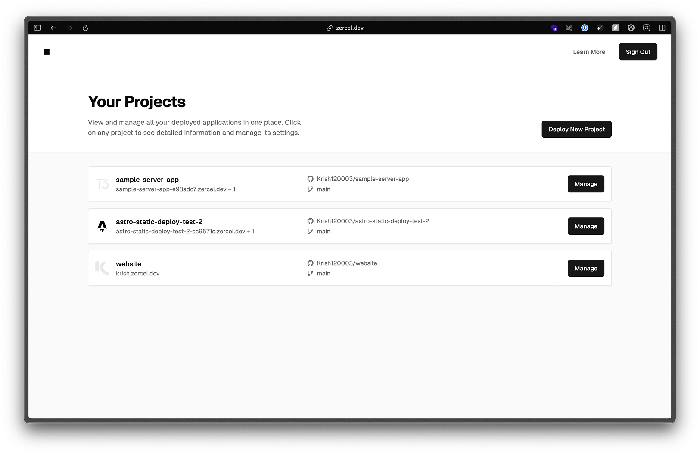

[](https://zercel.dev)

<!-- # [Zercel](https://zercel.dev) -->

God's greatest [Vercel](https://vercel.com) clone. Made by [Krish](https://x.com/n0tkr1sh).




- Automatic GitHub Deployments $_1$
- Live Build Logs
- Global CDN Caching
- Free dynamic SSL Certificates
- Environment Variables
- Instant-Subdomain(s) Deployment
- Fluid Compute (Serverless Server Functions) $_2$
- _[Upcoming]_ Instant Rollback
- _[Upcoming]_ Preview URLs
- _[Upcoming]_ Server Logs
- _[Upcoming]_ Server Version Skew Protection

## 📦 Project Structure

```
zercel/
├── apps/           # Application projects
│   ├── router/     # Network router
│   ├── builder/    # Build system
│   └── web/        # Web interface
└── terraform/      # Infrastructure as code
```

## 🏗️ Infrastructure

The project uses Terraform for infrastructure management. Configuration can be found in the `terraform/` directory.

This project uses the following services:

- Cloudflare CDN
- GCP Cloud Run (Webapp, Router)
- GCP Cloud Run Jobs (Static Builds)
- GCP Batch (Server builds by orchestrating isolated VMs)
- Neon Postgres (Cloud SQL is too expensive)
- Upstash Redis (Cloud Memorystore is too expensive)
- GCP Cloud Bucket (Static site builds)
- GCP Artifact Registry (Docker images for server builds)
- GCP Eventarc (Webhook triggers)

<!-- [Infrastructure Diagram Placeholder] -->

<!-- ## 📱 Applications

[Application Screenshots Placeholder] -->

## 📄 License

This project is licensed under the MIT License - see the [LICENSE](LICENSE) file for details.

---

**Footnotes:**

$_1$: Currently only supports default repository branch on public (but authorized) repositories.

$_2$: Google Cloud Run configured with multiple concurrent requests with autoscaling are used to create the same behaviour as [Vercel Fluid Compute](https://vercel.com/fluid)
